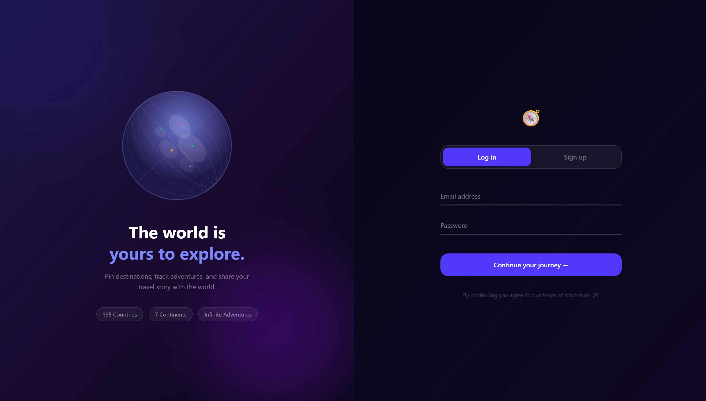
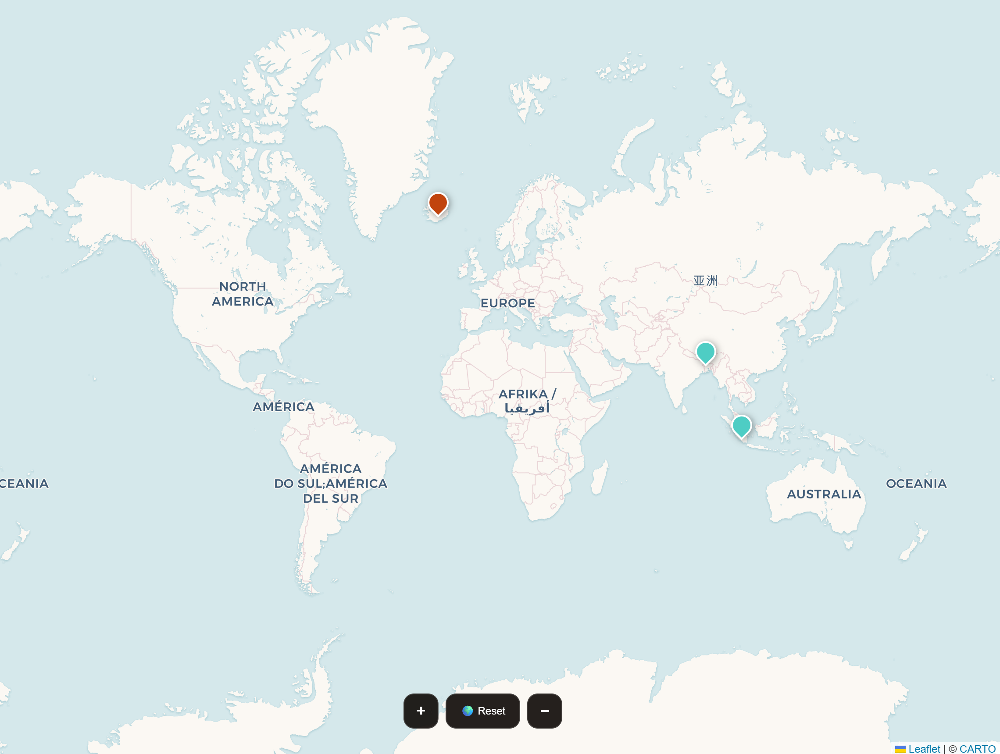
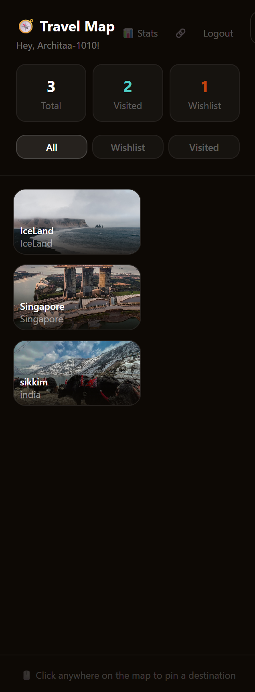
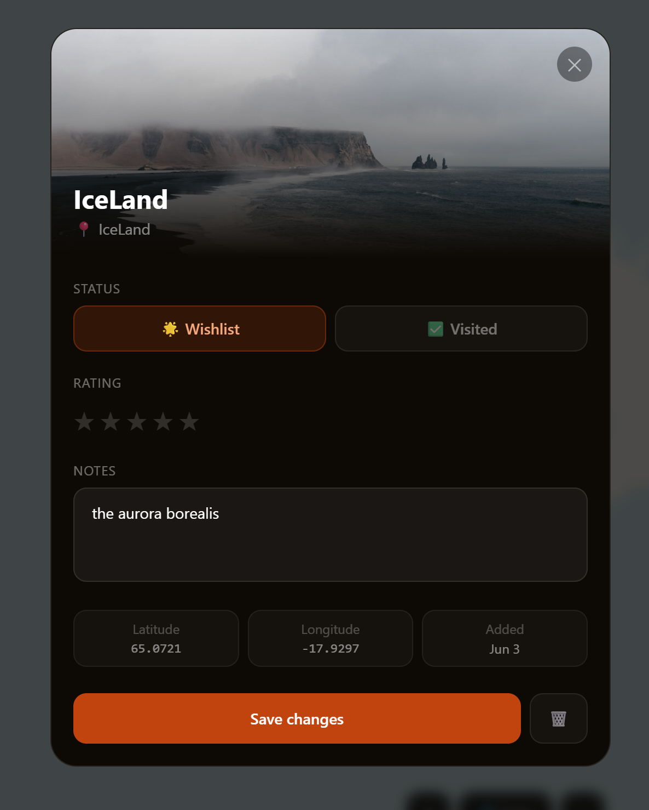
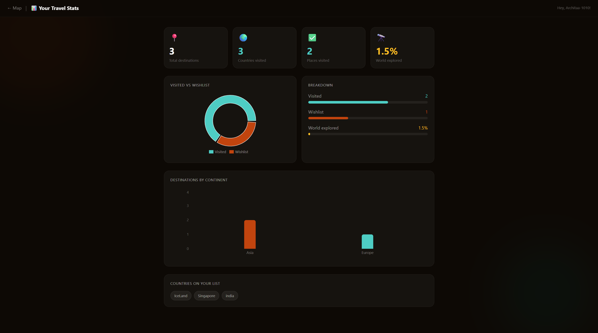
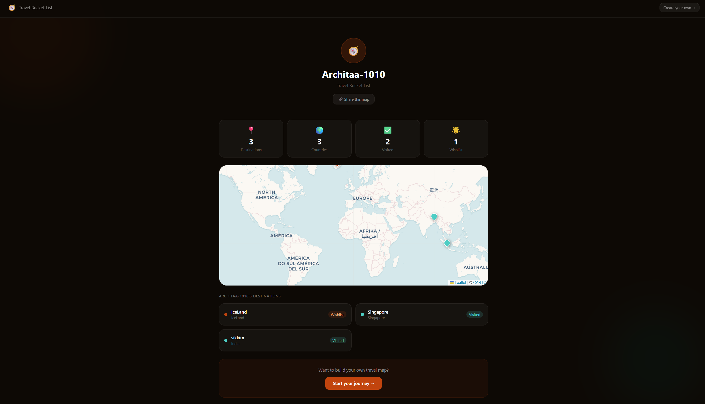

# 🌍 Travel Bucket List

A full-stack interactive travel map app where you can pin destinations, track adventures, and share your travel story with the world.

**[🚀 Live Demo](https://travel-bucket-list-oxfnopka8-1010achuanand-2387s-projects.vercel.app)** · **[Backend API](https://travel-bucket-list-96nk.onrender.com)**

---

## 📸 Screenshots

### Login


### Interactive Map


### Destination Cards with Photos


### Destination Detail Modal


### Stats Dashboard


### Public Profile


---

## ✨ Features

- 🗺️ **Interactive world map** — click anywhere to pin a destination
- 📍 **Color-coded pins** — coral for wishlist, teal for visited
- 🖼️ **Auto photos** — Unsplash API fetches real photos for every destination
- ⭐ **Star ratings** — rate and review each destination
- 📊 **Stats dashboard** — charts showing visited vs wishlist, destinations by continent
- 🔗 **Public profiles** — shareable travel map at `/user/:username`
- 🔐 **JWT authentication** — secure register and login
- 📱 **Fully responsive** — works beautifully on mobile and desktop
- 🎨 **Smooth animations** — Framer Motion page transitions and card animations

---

## 🛠️ Tech Stack

### Frontend
| Technology | Purpose |
|------------|---------|
| React + Vite | Frontend framework |
| Tailwind CSS | Styling |
| Framer Motion | Animations |
| Leaflet + React Leaflet | Interactive map |
| Recharts | Data visualizations |
| Axios | API requests |
| React Router | Client-side routing |

### Backend
| Technology | Purpose |
|------------|---------|
| Node.js + Express | REST API server |
| PostgreSQL (Neon) | Database |
| JWT | Authentication |
| bcryptjs | Password hashing |
| CORS | Cross-origin requests |

### Deployment
| Service | Purpose |
|---------|---------|
| Vercel | Frontend hosting |
| Render | Backend hosting |
| Neon | PostgreSQL database |

---

## 🚀 Getting Started

### Prerequisites
- Node.js v18+
- Git

### Clone the repo
```bash
git clone https://github.com/Architaa-1010/travel-bucket-list.git
cd travel-bucket-list
```

### Setup the backend
```bash
cd server
npm install
```

Create a `.env` file inside `server/`:
PORT=5000
DATABASE_URL=your_postgresql_connection_string
JWT_SECRET=your_jwt_secret
Run the server:
```bash
npm run dev
```

### Setup the frontend
```bash
cd client
npm install
```

Create a `.env` file inside `client/`:
VITE_UNSPLASH_KEY=your_unsplash_access_key
Run the frontend:
```bash
npm run dev
```

Open `http://localhost:5173`

---

## 📡 API Endpoints

### Auth
| Method | Endpoint | Description |
|--------|----------|-------------|
| POST | `/api/auth/register` | Register a new user |
| POST | `/api/auth/login` | Login and get JWT token |

### Destinations (Protected)
| Method | Endpoint | Description |
|--------|----------|-------------|
| GET | `/api/destinations` | Get all destinations |
| POST | `/api/destinations` | Add a destination |
| PATCH | `/api/destinations/:id` | Update a destination |
| DELETE | `/api/destinations/:id` | Delete a destination |

### Public
| Method | Endpoint | Description |
|--------|----------|-------------|
| GET | `/api/destinations/public/:username` | Get public profile |

---

## 🗄️ Database Schema

```sql
users (
  id, username, email, password_hash, created_at
)

destinations (
  id, user_id, name, country,
  latitude, longitude, status,
  notes, rating, created_at
)
```

---

## 👩‍💻 Author

**Architaa** — [GitHub](https://github.com/Architaa-1010)

---

## 📄 License

MIT